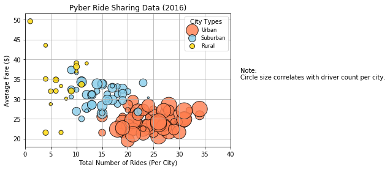
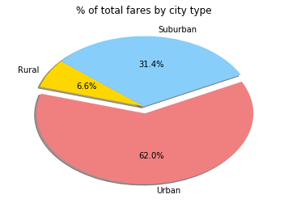
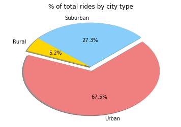
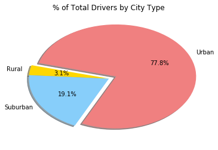

# Pyber Ride Sharing
### Analysis
1. It looks like the urban area has dominated the ride sharing market as it occupies nearly 70% of the whole market according to the three pie charts.
2. The market in rural area has the potential to be expanded if more drivers could join in the party.
3. According to pie charts1,2 and 3 in all, rural area has much less drivers than the other two types of cities, which leads to the less total rides and therefore less ride fares.


```python
import pandas as pd
import numpy as np
import matplotlib.pyplot as plt
```


```python
#import raw data 1
csv_path_1 = "Pyber/Raw data/city_data copy.csv"
city_data_df = pd.read_csv(csv_path_1)
city_data_df.head()
```


<div>
<style>
    .dataframe thead tr:only-child th {
        text-align: right;
    }

    .dataframe thead th {
        text-align: left;
    }

    .dataframe tbody tr th {
        vertical-align: top;
    }
</style>
<table border="1" class="dataframe">
  <thead>
    <tr style="text-align: right;">
      <th></th>
      <th>city</th>
      <th>driver_count</th>
      <th>type</th>
    </tr>
  </thead>
  <tbody>
    <tr>
      <th>0</th>
      <td>Kelseyland</td>
      <td>63</td>
      <td>Urban</td>
    </tr>
    <tr>
      <th>1</th>
      <td>Nguyenbury</td>
      <td>8</td>
      <td>Urban</td>
    </tr>
    <tr>
      <th>2</th>
      <td>East Douglas</td>
      <td>12</td>
      <td>Urban</td>
    </tr>
    <tr>
      <th>3</th>
      <td>West Dawnfurt</td>
      <td>34</td>
      <td>Urban</td>
    </tr>
    <tr>
      <th>4</th>
      <td>Rodriguezburgh</td>
      <td>52</td>
      <td>Urban</td>
    </tr>
  </tbody>
</table>
</div>


```python
#import raw data 2
csv_path_2 = "Pyber/Raw data/ride_data copy.csv"
ride_data_df = pd.read_csv(csv_path_2)
ride_data_df.head()


```


<div>
<style>
    .dataframe thead tr:only-child th {
        text-align: right;
    }

    .dataframe thead th {
        text-align: left;
    }

    .dataframe tbody tr th {
        vertical-align: top;
    }
</style>
<table border="1" class="dataframe">
  <thead>
    <tr style="text-align: right;">
      <th></th>
      <th>city</th>
      <th>date</th>
      <th>fare</th>
      <th>ride_id</th>
    </tr>
  </thead>
  <tbody>
    <tr>
      <th>0</th>
      <td>Sarabury</td>
      <td>2016/01/16 13:49:00</td>
      <td>38.35</td>
      <td>5400000000000</td>
    </tr>
    <tr>
      <th>1</th>
      <td>South Roy</td>
      <td>2016/01/02 18:42:00</td>
      <td>17.49</td>
      <td>4040000000000</td>
    </tr>
    <tr>
      <th>2</th>
      <td>Wiseborough</td>
      <td>2016/01/21 17:35:00</td>
      <td>44.18</td>
      <td>3650000000000</td>
    </tr>
    <tr>
      <th>3</th>
      <td>Spencertown</td>
      <td>2016/07/31 14:53:00</td>
      <td>6.87</td>
      <td>2240000000000</td>
    </tr>
    <tr>
      <th>4</th>
      <td>Nguyenbury</td>
      <td>2016/07/09 04:42:00</td>
      <td>6.28</td>
      <td>1540000000000</td>
    </tr>
  </tbody>
</table>
</div>


```python
#merge two tables with city name
merge_table_df= pd.merge(city_data_df,ride_data_df, on="city")

merge_table_df.head()


```


<div>
<style>
    .dataframe thead tr:only-child th {
        text-align: right;
    }

    .dataframe thead th {
        text-align: left;
    }

    .dataframe tbody tr th {
        vertical-align: top;
    }
</style>
<table border="1" class="dataframe">
  <thead>
    <tr style="text-align: right;">
      <th></th>
      <th>city</th>
      <th>driver_count</th>
      <th>type</th>
      <th>date</th>
      <th>fare</th>
      <th>ride_id</th>
    </tr>
  </thead>
  <tbody>
    <tr>
      <th>0</th>
      <td>Kelseyland</td>
      <td>63</td>
      <td>Urban</td>
      <td>2016/08/19 04:27:00</td>
      <td>5.51</td>
      <td>6250000000000</td>
    </tr>
    <tr>
      <th>1</th>
      <td>Kelseyland</td>
      <td>63</td>
      <td>Urban</td>
      <td>2016/04/17 06:59:00</td>
      <td>5.54</td>
      <td>7470000000000</td>
    </tr>
    <tr>
      <th>2</th>
      <td>Kelseyland</td>
      <td>63</td>
      <td>Urban</td>
      <td>2016/05/04 15:06:00</td>
      <td>30.54</td>
      <td>2140000000000</td>
    </tr>
    <tr>
      <th>3</th>
      <td>Kelseyland</td>
      <td>63</td>
      <td>Urban</td>
      <td>2016/01/25 20:44:00</td>
      <td>12.08</td>
      <td>1900000000000</td>
    </tr>
    <tr>
      <th>4</th>
      <td>Kelseyland</td>
      <td>63</td>
      <td>Urban</td>
      <td>2016/08/09 18:19:00</td>
      <td>17.91</td>
      <td>8780000000000</td>
    </tr>
  </tbody>
</table>
</div>


### Bubble Plot of Ride Sharing Data


```python
# Group the cities by city type and count the ride_count by each city, 
# average the fare by each city and average the dirvers by each city

urban_cities=merge_table_df[merge_table_df["type"]=="Urban"]
suburban_cities=merge_table_df[merge_table_df["type"]=="Suburban"]
rural_cities=merge_table_df[merge_table_df["type"]=="Rural"]

```


```python
urban_ride_count=urban_cities.groupby('city')["ride_id"].count()
urban_fare_avg=urban_cities.groupby('city')["fare"].mean()
urban_driver_count=urban_cities.groupby('city')["driver_count"].mean()

suburban_ride_count=suburban_cities.groupby('city')["ride_id"].count()
suburban_fare_avg=suburban_cities.groupby('city')["fare"].mean()
suburban_driver_count=suburban_cities.groupby('city')["driver_count"].mean()

rural_ride_count=rural_cities.groupby('city')["ride_id"].count()
rural_fare_avg=rural_cities.groupby('city')["fare"].mean()
rural_driver_count=rural_cities.groupby('city')["driver_count"].mean()
```


```python
#Build the scatter plots for each city type

plt.scatter(urban_ride_count, 
            urban_fare_avg, 
            s=10*urban_driver_count, c="coral", 
            edgecolor="black", linewidths=1, marker="o", 
            alpha=0.8, label="Urban")

plt.scatter(suburban_ride_count, 
            suburban_fare_avg, 
            s=10*suburban_driver_count, c="skyblue", 
            edgecolor="black", linewidths=1, marker="o", 
            alpha=0.8, label="Suburban")

plt.scatter(rural_ride_count, 
            rural_fare_avg, 
            s=10*rural_driver_count, c="gold", 
            edgecolor="black", linewidths=1, marker="o", 
            alpha=0.8, label="Rural")

#Incorporate the other graph properties
plt.title("Pyber Ride Sharing Data (2016)")
plt.ylabel("Average Fare ($)")
plt.xlabel("Total Number of Rides (Per City)")
plt.xlim((0,40))

plt.grid(True)

# Create a legend
lgnd = plt.legend(fontsize="small", mode="Expanded", 
                  numpoints=1, scatterpoints=1, 
                  loc="best", title="City Types", 
                  labelspacing=0.5)
lgnd.legendHandles[0]._label = "hi"
# lgnd.legendHandles[1]._sizes = [30]
# lgnd.legendHandles[2]._sizes = [30]

# Incorporate a text label regarding circle size
plt.text(42, 35, "Note:\nCircle size correlates with driver count per city.")

# Show plot
plt.show()
```





### Total Fares by City Type


```python
#Group by city type and then sum up the fares by each city type
city_type=merge_table_df.groupby('type')

total_fare_type=city_type["fare"].sum()

total_fare_type


```


    type
    Rural        4255.09
    Suburban    20335.69
    Urban       40078.34
    Name: fare, dtype: float64


```python
labels = ["Rural", "Urban", "Suburban"]

# The values of each section of the pie chart
sizes = [4255.09, 40078.34, 20335.69]

# The colors of each section of the pie chart
colors = ["gold", "lightcoral", "lightskyblue"]

# Tells matplotlib to seperate the "Python" section from the others
explode = (0,0.1,0)

plt.pie(sizes,labels=labels, colors=colors,explode=explode ,
        autopct="%1.1f%%", shadow=True, startangle=140)

plt.title('% of total fares by city type')
plt.show()
```





### Total Rides by City Type


```python
#Group by city type and then count the total ride by each city type
city_type=merge_table_df.groupby("type")

total_ride_type=city_type["ride_id"].count()

total_ride_type


```


    type
    Rural        125
    Suburban     657
    Urban       1625
    Name: ride_id, dtype: int64


```python
labels = ["Rural", "Urban", "Suburban"]

# The values of each section of the pie chart
sizes = [125, 1625, 657]

# The colors of each section of the pie chart
colors = ["gold", "lightcoral", "lightskyblue"]

# Tells matplotlib to seperate the "Python" section from the others
explode = (0,0.1,0)

plt.pie(sizes,labels=labels, colors=colors,explode=explode ,
        autopct="%1.1f%%", shadow=True, startangle=140)

plt.title('% of total rides by city type')
plt.show()
```





### Total Drivers by City Type


```python
#Calculate the percentage 

drivers_percent = 100*city_data_df.groupby('type').sum()["driver_count"]/city_data_df["driver_count"].sum()


```


```python
plt.pie(drivers_percent, labels=["Rural", "Suburban", "Urban"], colors=["gold", "lightskyblue", "lightcoral"], 
        explode=[0, 0, 0.1], 
        autopct='%1.1f%%', 
        shadow=True, startangle=165)
plt.title("% of Total Drivers by City Type")


plt.show()
```




